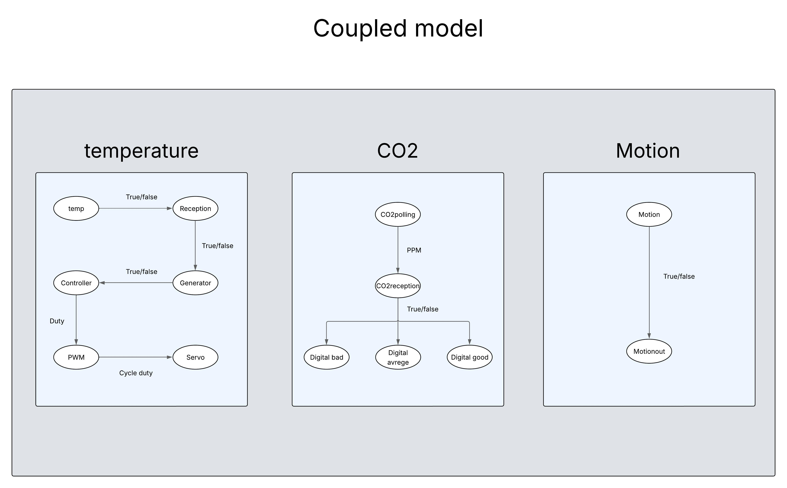

# stm32_lab_project
the automative lab project in the stm32

This project is a DEVS-based example running on an STM32H743ZI2 development board. It models a **smart home room** where **CO₂** and **temperature** levels are monitored .Depending on the temperature, the system can automatically **turn the air conditioner (AC) on** to regulate the environment, and a motion sensor that detect if there is someone on the room,and turns an led off if someone enters the room.

## Features

- Real-time CO₂ and temperature monitoring
- Automatic AC activation based on temperature thresholds
- a servo motor type FS90R
- Motion sensor
- flashing led 
- Implemented using the DEVS formalism with Cadmium
- Runs on STM32H743ZI2 using ARM toolchain

## Prerequisites

- STM32H743ZI2 development board connected via USB
- Sensors properly wired (see installation diagram below)
- Cadmium simulator installed
- ARM toolchain: `gcc-arm-none-eabi`

## Installation

1. **Install the ARM GCC toolchain**:

```bash
sudo apt install gcc-arm-none-eabi
```
## Wiring and running 
1. **Wirning**:
### DHT11 – Temperature Sensor

| Signal | DHT11  Pin | STM32 Pin Example | Notes                        |
|--------|------------|-------------------|------------------------------|
| VCC    | 5V         | 3.3V              | Power supply                 |
| GND    | GND        | GND               | Common ground                |
| Out    | Out        | PB9               | Digital out                  |

**Note** :
After wiring the sensor, wait at least 10 minutes before initialization to allow it to stabilize.
If the main project fails to run, test the stm32_temperature project first and ensure the onboard LED turns on, indicating proper operation.

---

### MG-811 – CO₂ Sensor (Analog Output)

| Signal | MG-811 Pin | STM32 Pin Example | Notes                                 |
|--------|------------|-------------------|---------------------------------------|
| VCC    | V+         | 5V                | Requires stable 5V supply             |
| GND    | GND        | GND               | Common ground                         |
| OUT    | AO         | PA0               | Analog output connected to ADC input  |

**Note** :
After wiring the sensor, wait at least 10 minutes before initialization to allow it to stabilize.
If the main project fails to run, test the stm32_CO2 project first and ensure the onboard LED turns on, indicating proper operation.

---

### Servo motor(PWM)

| Signal | Servo motor Pin | STM32 Pin Example | Notes                                 |
|--------|-----------------|-------------------|---------------------------------------|
| VCC    | V+              | 5V                | Requires stable 5V supply             |
| GND    | GND             | GND               | Common ground                         |
| PWM    | out             | PD12              | PWM output                            |

---
### PIR motion sensor (Digital input)

| Signal | PIR Pin    | STM32 Pin Example | Notes                                   |
|--------|------------|-------------------|-----------------------------------------|
| VCC    | V+         | 5V                | Requires stable 5V supply               |
| GND    | GND        | GND               | Common ground                           |
| OUT    | AO         | PE0               | Digital input connected to digital pin  |

---
### Flahing LED
(Digital output)

| Signal | PIR Pin    | STM32 Pin Example | Notes                                   |
|--------|------------|-------------------|-----------------------------------------|
| VCC    | Yellow     | 5V                | Requires stable 5V supply               |
| GND    | Black      | PG1               | Digital pin                             |

---

### Summary of STM32 Pin Connections

| Function         | STM32 Pin |
|------------------|-----------|
| DHT11            | PB9       |
| Servo motor      | PD12      |
| ADC (MG-811)     | PA0       |
| Motion sensor    | PE0       |


3. **Running**:

```bash
git clone https://github.com/Ouabm/stm32_lab_project.git
```
  then
```bash
cd stm32_lab_project/
```
  then
```bash
./build_stm32
```
### PINs


